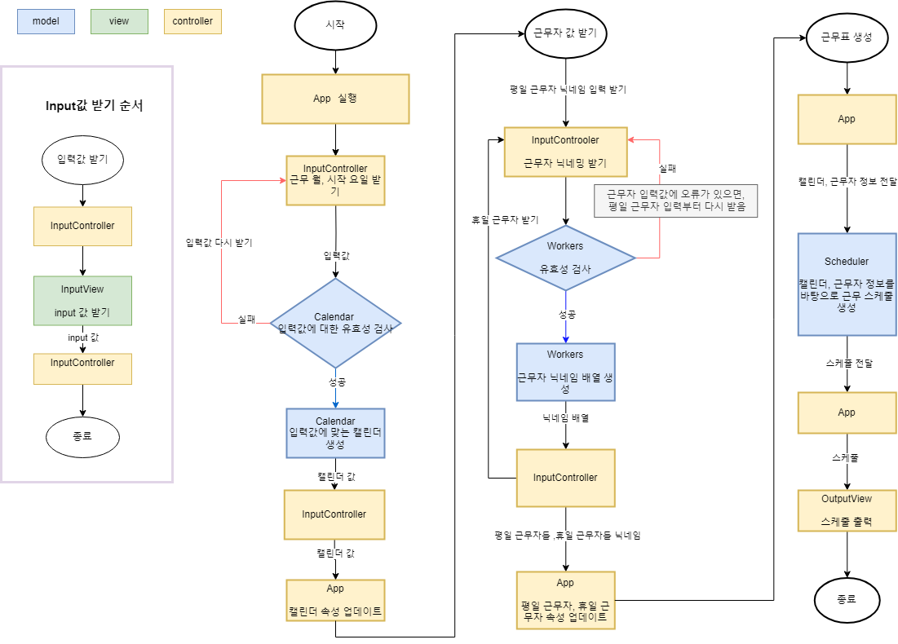

# 미션 - 개발자 비상근무

## 소개

[우아한 테크코스6기 코딩 테스트](https://github.com/woowacourse-precourse/javascript-oncall-6) 입니다.

### 과제 구현 모습


### 순서도

<details>
<summary>순서도  보기</summary>
<div markdown="1">

</div>
</details>

### 파일 구조

<details>
<summary>파일 구조 보기</summary>
<div markdown="1">

```
📦src
┣ 📂constants :상수 관리
┃ ┣ 📜index.js
┃ ┣ 📜Message.js : 입출력 메세지 관리
┃ ┗ 📜Rule.js : 과제 룰에 대한 상수 관리
┣ 📂controllers
┃ ┣ 📜index.js
┃ ┗ 📜InputController.js : 입력 컨트롤러
┣ 📂models
┃ ┣ 📜Calendar.js : 근무하는 달,시작 요일에 대한 유효성 검사 및 해당 달에 대한 캘린더 생성,반환
┃ ┣ 📜index.js
┃ ┣ 📜Schedule.js : 근무하는 달에 근무자들 배정하는 근무 스케줄러 생성,반환
┃ ┗ 📜Workers.js : 근무자들에 대한 유효성 검사 및 근무자 닉네임 배열 생성,반환
┣ 📂utils
┃ ┣ 📜Date.js : 날짜에 관한 유틸함수 관리
┃ ┗ 📜index.js
┣ 📂views
┃ ┣ 📜index.js
┃ ┣ 📜InputView.js : 메세지 입력 관리
┃ ┗ 📜OutputView.js : 메세지 출력 관리
┣ 📜App.js
┣ 📜CustomError.js : 오류 관리
┗ 📜index.js
```

</div>
</details>

### 타입 정리

```ts
type Week = ('월' | '화' | '수' | '목' | '금' | '토' | '일')[];

type Calendar = {
  month: number;
  day: string;
  date: number;
  isWeekend: boolean;
  isPublicHoliday: boolean;
}[];

type Workers = {
  weekday: string[];
  holiday: string[];
};

type Schedule = {
  month: number;
  day: string;
  date: number;
  isWeekend: boolean;
  isPublicHoliday: boolean;
  worker: string;
}[];
```
